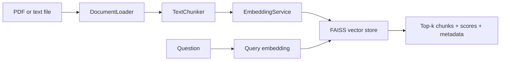

<!-- # Beginner-friendly RAG: retrieval milestone

This repository currently implements the **retrieval half** of Retrieval-Augmented
Generation (RAG). It deliberately does not call an LLM yet. First we verify that
the system can find useful evidence; generation will be a separate milestone.

RAG gives an LLM relevant excerpts from your own documents before asking it to
answer. Retrieval does not train or modify the LLM. It searches for context that
is semantically close to the user's question. -->

## Current architecture



Each component has one visible responsibility:

- `DocumentLoader` receives a file path and returns extracted `Document` objects.
  PDF pages remain separate so page numbers can be cited. Scanned PDFs need OCR
  and are not supported yet.
- `TextChunker` receives documents and returns overlapping `TextChunk` objects.
  Smaller chunks make retrieval more precise. Overlap protects context that falls
  across a chunk boundary. This first version measures size in characters, not
  model tokens.
- `EmbeddingService` receives strings and returns NumPy arrays. For `N` chunks,
  its output shape is `(N, D)`, where `D` is the model's embedding dimension. A
  query becomes one vector of shape `(D,)`. The same model places documents and
  questions in the same semantic space so they can be compared.
- `FaissVectorStore` receives chunks and vectors. It L2-normalizes vectors and
  uses an inner-product index; inner product between normalized vectors is cosine
  similarity. It returns the top-k chunks with score and original metadata.
- `Retriever` embeds a question and calls the vector store. It knows nothing about
  prompts or LLMs. `VectorStore` is a small protocol, allowing a later Qdrant or
  pgvector implementation without changing the retriever.
- `RetrievalPipeline` wires ingestion and querying together without hiding any of
  those steps.

The FAISS index is in memory in this milestone. It is lost when the process exits.

## Install

Python 3.10 or newer is required. From the repository root:

```powershell
python -m venv .venv
.venv\Scripts\Activate.ps1
python -m pip install --upgrade pip
pip install -r requirements.txt
Copy-Item .env.example .env
```

The code reads the shown environment variables directly. A `.env` file is a
template for the later API milestone; load it in your shell or set variables
before running if you want values other than the defaults. No paid API or key is
needed for retrieval. The embedding model is downloaded from Hugging Face on its
first real use and then cached locally.

## Run the tests

```powershell
pytest -q
```

Tests use a deterministic keyword embedder, so they do not download a model or
call a paid API. They cover chunking, source metadata, text loading, FAISS search,
and the end-to-end retrieval pipeline.

## Try retrieval on your own document

Put a `.txt` or `.pdf` file anywhere (the ignored `data/` directory is handy),
then run from the repository root:

```powershell
python -m scripts.demo_retrieval data\example.txt "What problem does the method solve?" --top-k 3
```

The output lists cosine scores, filenames, PDF page numbers when applicable,
chunk IDs, and retrieved text. On the first run, model download can take a little
time.

<!-- ## Current limitations and next milestone

- PDF text extraction only; no OCR, tables, or layout reconstruction.
- Character-based chunking is intentionally simple.
- In-memory exact FAISS search; no persistence or deletion.
- One process owns one index; there is no upload API yet.
- No prompt construction or LLM generation yet.

Once retrieval is verified, the next milestone can add Pydantic request/response
schemas and FastAPI upload/query routes. Only after that should generation build a
grounded prompt from these retrieved chunks and return the same source metadata. -->
