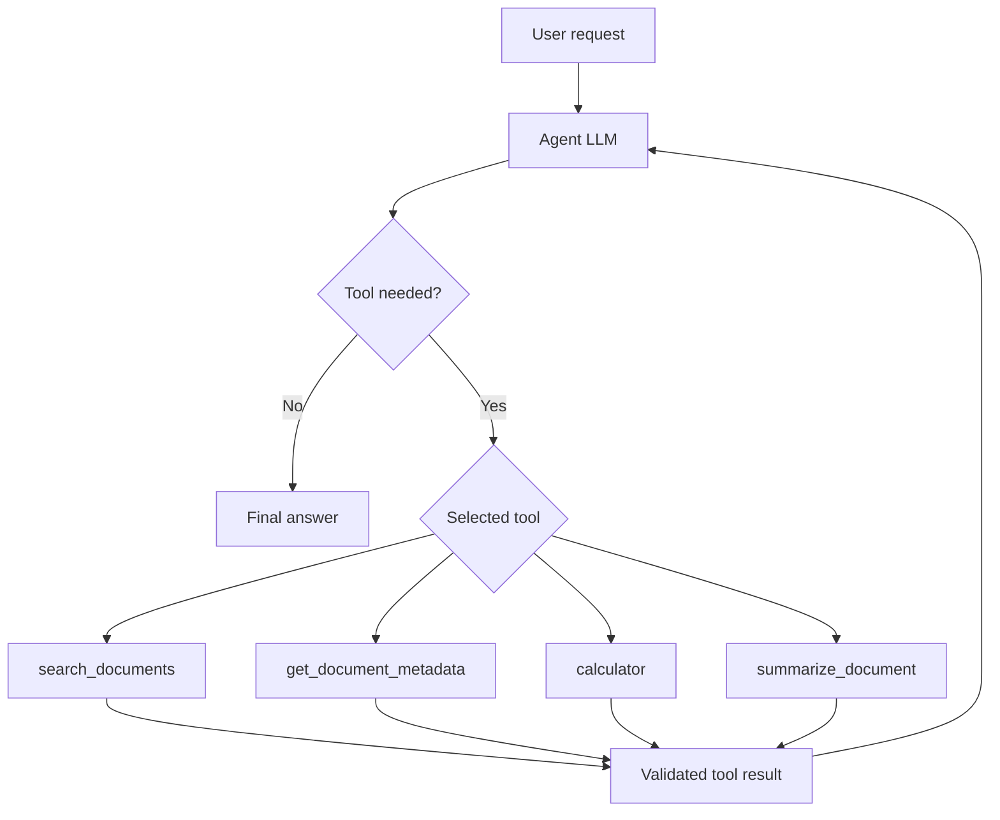

# Beginner-friendly Agentic RAG

This project implements both a normal Retrieval-Augmented Generation (RAG)
pipeline and a small, explicit tool-using agent. It avoids LangChain, LangGraph,
CrewAI, and other agent frameworks so the control flow remains visible.

## Normal RAG versus Agentic RAG

Normal RAG always follows one fixed path:

```text
question -> retrieve top-k chunks -> construct grounded prompt -> LLM answer
```

Agentic RAG lets the model choose the next operation. It can answer directly,
search documents, inspect the collection, calculate a value, summarize a whole
document, or make several sequential tool calls before answering.



The implementation uses local Ollama chat/tool calling. The provider-specific
conversion is isolated in `app/llm/ollama_client.py`; the loop itself remains
ordinary Python.

<!-- ## Repository architecture

```text
app/
  services.py                constructs shared RAG and agent services
  core/config.py             .env configuration
  rag/
    document_loader.py       PDF/text extraction
    chunker.py               overlapping character chunks
    embeddings.py            sentence-transformer vectors
    vector_store.py          FAISS and document catalog access
    retriever.py             query embedding plus top-k search
    generator.py             direct RAG grounded prompt
    pipeline.py              ingestion orchestration
  agent/
    agent.py                 explicit tool loop
    state.py                 ordered conversation events
    registry.py              definitions, validation, and dispatch
    prompts.py               editable agent instructions
    schemas.py               agent events, traces, and results
    tools/
      document_search.py
      document_metadata.py
      calculator.py
      summarize_document.py
scripts/
  demo_retrieval.py
  demo_agent.py
tests/
``` -->

## Retrieval pipeline

`DocumentLoader` receives a path and emits clean `Document` objects. PDFs remain
separated by page so page citations survive. `TextChunker` emits overlapping
`TextChunk` objects containing text, filename, page, chunk ID, and extra metadata.
Overlap protects context near a chunk boundary.

`EmbeddingService` maps N strings to an array of shape `(N, D)`. A query is
mapped by the same model to shape `(D,)`, placing documents and questions in the
same semantic vector space. FAISS L2-normalizes these vectors and performs inner
product search; for normalized vectors, that score is cosine similarity.

The FAISS adapter also exposes read-only `list_chunks()` catalog access. This is
needed because metadata lookup and whole-document summarization require complete
coverage, not similarity search. A future Qdrant or pgvector adapter can implement
the same `VectorStore` protocol.

## Agent loop

`Agent.run()` performs these operations explicitly:

1. Add the user message to `AgentState`.
2. Send the ordered state and JSON tool definitions to the LLM.
3. If the model returns function calls, append each call to state.
4. Look up the tool in `ToolRegistry`.
5. Validate its JSON arguments with its Pydantic input model.
6. Execute the handler and wrap success or failure in a structured result.
7. Append the tool result using the matching call ID.
8. Send the expanded state to the LLM again.
9. Stop when the model returns text without tool calls, or when the configured
   maximum step count is reached.

The state contains user messages, assistant messages, tool requests, and tool
results. Optional conversation IDs retain that state in memory for subsequent
requests. This is request/session history, not long-term memory, and disappears
when the process restarts.

### Available tools

- `search_documents(query, top_k=5)` calls the configured retrieval backend and returns
  text, filename, page, chunk ID, metadata, and backend-specific relevance score.
- `get_document_metadata(filename=None)` lists indexed filenames, pages, chunk
  counts, and stored metadata.
- `calculator(expression)` parses arithmetic with an AST whitelist. It permits
  numbers, parentheses, `+`, `-`, `*`, `/`, and bounded `**`; it never uses
  `eval` and rejects names or function calls.
- `summarize_document(filename)` enumerates all chunks for an exact filename.
  It summarizes bounded batches and then reduces the partial summaries. Both
  batch size and maximum batch count are configurable.

Tool failures and unknown tools become structured observations for the LLM, so it
can correct arguments or answer differently. Logs include steps, selected tools,
arguments, durations, success/failure, and final LLM/tool counts. They never log
secrets or private model reasoning.

Structured result sources are collected from actual tool outputs rather than being
trusted from generated text. The model is separately instructed to cite sources
as `[paper.pdf, page 5]`.

## Installation and configuration

Python 3.10 or newer is required.

```powershell
python -m venv .venv
.venv\Scripts\Activate.ps1
python -m pip install --upgrade pip
pip install -r requirements.txt
Copy-Item .env.example .env
```

Make sure Ollama is running and the local model is available:

```powershell
ollama pull qwen3:14b-q4_K_M
ollama serve
```

Configure `.env` without committing it:

```env
OLLAMA_HOST=http://localhost:11434
LLM_MODEL=qwen3:14b-q4_K_M
EMBEDDING_MODEL_NAME=sentence-transformers/all-MiniLM-L6-v2
CHUNK_SIZE=500
CHUNK_OVERLAP=75
DEFAULT_TOP_K=5
MAX_AGENT_STEPS=6
SUMMARY_BATCH_CHARS=8000
MAX_SUMMARY_BATCHES=12
```

For Vietnamese or mixed-language documents, use a multilingual embedding model:

```env
EMBEDDING_MODEL_NAME=sentence-transformers/paraphrase-multilingual-MiniLM-L12-v2
```

Changing the embedding model requires rebuilding the in-memory index.

## Run the project

Index one or more files and run six examples: direct response, retrieval,
calculation, comparison, summary, and missing information.

```powershell
python -m scripts.demo_agent sample.txt
python -m scripts.demo_agent data\paper_a.pdf data\paper_b.pdf
```

Ask one custom question after indexing local files:

```powershell
python -m scripts.ask_agent sample.txt "What is this document about?"
python -m scripts.ask_agent data\paper_a.pdf data\paper_b.pdf "Compare the methods."
```

The script prints every selected tool and its validated arguments. Model tool
selection is probabilistic, so the exact calls can vary; automated tests use a
scripted fake LLM for deterministic loop verification. The embedding model is
downloaded on first use, and the FAISS index exists only for the lifetime of the
script.

The retrieval-only demo remains available:

```powershell
python -m scripts.demo_retrieval sample.txt "What is this document about?" --top-k 3
```

Run the benchmark retrieval evaluation without calling an LLM:

```powershell
python -m scripts.evaluate_retrieval
```

The evaluator indexes only the three PDFs listed in `benchmarks/rag_agent_benchmark.json`, checks their SHA-256 hashes, runs the eligible retrieval questions at K=1,3,5, and writes aggregate scores plus retrieved chunks under `benchmark_results/`.

Run the generation-backed agent-loop evaluation with Ollama available:

```powershell
python -m scripts.evaluate_agent
```

The agent evaluator indexes the same three PDFs, runs the summary, retrieval, table, abstention, and behavior cases, and writes `aggregate_scores.json`, `per_case_results.json`, `tool_traces.jsonl`, `answers.jsonl`, and `run_metadata.json` under `benchmark_results/agent_<timestamp>/`. It scores tool selection, source-page overlap, citation-page overlap, deterministic grounding/faithfulness proxies, behavior heuristics, latency, dependency versions, corpus hashes, and VRAM snapshots. Add `--judge-faithfulness` to use the configured local Ollama model for an extra faithfulness judgment over saved supporting chunks. Deferred web cases Q28-Q30 are skipped by default because there is no web-search tool; use `--include-deferred-web` only to test whether the current agent acknowledges that limitation.

## Completed benchmarks

The evaluations below cover retrieval and the generation-backed agent loop.
There is not yet a separate scored evaluation of the fixed-path RAG generator.
Results are individual runs, not averages across repeated generation trials.

### Dataset and configuration

The corpus contains only three SHA-256-verified PDFs:

| File | Paper | Indexed chunks |
| --- | --- | ---: |
| `q001.pdf` | Shape of Motion | 191 |
| `q002.pdf` | MoSca | 150 |
| `q003.pdf` | SplineGS | 145 |

All comparisons use `sentence-transformers/all-MiniLM-L6-v2`, 500-character
chunks, and 75-character overlap. BM25 uses `k1=1.5`, `b=0.75`; hybrid uses
equal-weight RRF with 20 candidates per backend and an RRF constant of 60.
Within each comparison, corpus and benchmark hashes match. The retrieval
comparison and agent comparison record different benchmark hashes, so their
scores should be interpreted within their respective evaluations.

### Retrieval-only RAG evaluation

The completed dense/BM25/hybrid comparison runs 23 evidence-labeled questions
at K=1,3,5, without generation or API credits. Metrics use filename and one-based
PDF page labels. Recall measures coverage of required evidence groups, accepting
their alternative labeled pages; complete evidence requires every group.
MRR measures the first matching result, and nDCG accounts for ranked coverage of
previously uncovered groups.

| Retrieval mode | K | Hit | Recall | MRR | nDCG | Complete evidence |
| --- | ---: | ---: | ---: | ---: | ---: | ---: |
| Dense | 1 | 39.1% | 37.0% | 0.391 | 0.391 | 34.8% |
| Dense | 3 | 56.5% | 51.1% | 0.471 | 0.464 | 47.8% |
| Dense | 5 | 69.6% | 64.1% | 0.501 | 0.516 | 60.9% |
| BM25 | 1 | 52.2% | 44.6% | 0.522 | 0.522 | 39.1% |
| BM25 | 3 | 69.6% | 62.0% | 0.594 | 0.563 | 56.5% |
| BM25 | 5 | 78.3% | 70.7% | 0.614 | 0.595 | 65.2% |
| Hybrid | 1 | 56.5% | 51.1% | 0.565 | 0.565 | 47.8% |
| Hybrid | 3 | 82.6% | 75.7% | 0.688 | 0.686 | 69.6% |
| Hybrid | 5 | 82.6% | 75.7% | 0.688 | 0.683 | 69.6% |

Mean retrieval latency was 14.0 ms for dense, 3.2 ms for BM25, and 16.3 ms for
hybrid, excluding indexing and generation. Hybrid leads this page-level baseline;
a matching page does not guarantee the returned chunk contains the actual evidence.

Saved comparison runs:

- [Dense](benchmark_results/comparison_dense_20261008T152846Z/aggregate_scores.json)
- [BM25](benchmark_results/comparison_bm25_20261008T152846Z/aggregate_scores.json)
- [Hybrid](benchmark_results/comparison_hybrid_20261008T152846Z/aggregate_scores.json)

Each directory also contains `per_question_results.json`, `retrieved_chunks.jsonl`,
and `run_metadata.json` for evidence inspection and reproducibility. Earlier dense
and BM25 runs remain under `benchmark_results/`, including the initial retrieval
baseline `retrieval_20261007T163355Z`.

### Agent response and behavior evaluation

The completed comparison uses local Ollama `qwen3:14b-q4_K_M`, the same system
prompt, and a six-step limit. Each mode runs 31 cases: three summaries, seven
narrative questions, 15 table/quantitative questions, one false-premise case,
one abstention case, and four basic tool/behavior cases. Web cases Q28-Q30 are
excluded. Evidence/citation metrics are scored on 27 cases and behavior checks
on six cases; neither is an overall answer-accuracy metric.

| Agent measure | Dense | Hybrid |
| --- | ---: | ---: |
| Completed cases | 31/31 | 31/31 |
| Source-page hit | 59.3% | 70.4% |
| Source-page recall | 54.6% | 63.9% |
| Source-page MRR | 0.463 | 0.543 |
| Complete source evidence | 51.9% | 59.3% |
| Recognized citation present | 63.0% | 66.7% |
| Complete citation evidence | 44.4% | 51.9% |
| Expected tool plan satisfied | 45.2% | 45.2% |
| No unexpected tools | 87.1% | 93.5% |
| Behavior checks passed (heuristic) | 5/6 | 3/6 |
| Grounding proxy score | 0.596 | 0.676 |
| Mean case latency | 36.69 s | 36.67 s |

Both runs took approximately 19 minutes and averaged two agent LLM calls per
case. GPU snapshots after evaluation showed 9,977 MB used on an RTX 4060 Ti
with 16,380 MB total. These snapshots are not continuous peak-VRAM measurements;
PyTorch's memory counters do not include the separate Ollama process.

Saved runs:

- [Dense agent](benchmark_results/agent_dense_comparison/aggregate_scores.json)
- [Hybrid agent](benchmark_results/agent_hybrid_comparison/aggregate_scores.json)

Each directory contains `per_case_results.json`, `answers.jsonl`, `tool_traces.jsonl`,
and `run_metadata.json`. The earlier full agent baseline is saved in
`agent_20261008T110618Z`; behavior-only smoke tests are in
`agent_20261007T183006Z`. The failed `agent_20261007T174954Z` run reflects an
unavailable Ollama server and is not a model-quality baseline.

Reviewing the paired responses exposes problems that aggregate page scores miss:

- Q12: hybrid finds the labeled page but answers 5.3 percentage points; the
  benchmark reference is 9.5 (34.4 minus 24.9).
- Q18: hybrid finds the ablation page but omits the reported PCK-T decrease
  from 0.824 to 0.737, instead giving a qualitative explanation.
- Q01: both agents treat the paper title as a missing filename instead of
  resolving it to `q001.pdf`.
- Q27: both accept the false COLMAP premise; hybrid answers without retrieval.
- B01: hybrid passes `filename=""` to metadata lookup and incorrectly reports
  an empty corpus. This tool does not use retrieval fusion, so the failure
  should not be attributed directly to hybrid search.
- Q26: hybrid correctly says mobile inference speed is unspecified, but the
  keyword-based abstention check marks it as a failure.
- Neither run uses `calculator` in any of the 15 quantitative cases.

The default faithfulness score is a deterministic grounding proxy, not a
claim-by-claim correctness assessment. Citation support checks whether recognized
citation pages occur in returned sources, not whether they support each claim;
the parser also misses some citation formats such as page ranges. These saved
runs did not enable `--judge-faithfulness`. Summary quality and quantitative
answer correctness still need dedicated scoring beyond page overlap.

Hybrid improves evidence coverage in these runs, but reliable answers still
require better table extraction/interpretation, document resolution, calculation
tool selection, and false-premise handling.

### Reproducing the agent comparison

With Ollama served inside `RAGagent`, run each mode sequentially from the project
directory using the container's virtual environment. Use new output directories
to preserve existing results:

```bash
cd /source/RAG_research_assistance
RETRIEVAL_MODE=dense .venv/bin/python -m scripts.evaluate_agent --output-dir benchmark_results/agent_dense_new
RETRIEVAL_MODE=hybrid .venv/bin/python -m scripts.evaluate_agent --output-dir benchmark_results/agent_hybrid_new
```

Keep the model, prompt, corpus, chunking, cases, and judge settings fixed when
comparing retrieval modes. Inspect saved answers alongside metrics; a single
generation run cannot establish that every behavior change is caused by retrieval.

## Tests

```powershell
pytest -q
```

Tests never call Ollama. They use deterministic embeddings, a recording text
generator, and scripted agent responses. Coverage includes chunking, metadata,
retrieval, safe arithmetic, invalid arguments, unknown tools, map-reduce
summarization, source collection, the two-turn tool loop, and maximum steps.

## Example control flow: compare Method A and Method B

1. The user message, existing conversation events, system instruction, and tool
   definitions are sent to the agent LLM.
2. The model requests `search_documents` with a query focused on Method A.
3. The registry validates the arguments. The existing retriever embeds the query,
   searches FAISS, and returns relevant chunks with source metadata.
4. The request and result are appended to `AgentState`, then sent to the LLM.
5. The model can request `search_documents` again with a Method B query.
6. That second call and result are also appended. Both evidence sets are now
   visible to the next model call.
7. The model returns final comparison text rather than another tool call.
8. The agent result contains that text, deduplicated sources collected from both
   searches, and the tool-call trace. If the model keeps calling tools, the loop stops at
   `MAX_AGENT_STEPS` and returns a controlled limit response.

This is what makes the system agentic: the application supplies capabilities and
safety boundaries, while the model selects the sequence dynamically.

<!-- ## Current limitations

- FAISS data and conversations are process-local and not persisted.
- Scanned PDFs, complex tables, and layout reconstruction require OCR/parsing work.
- Chunk size and summary limits use characters rather than tokenizer counts.
- Summary input is capped by `MAX_SUMMARY_BATCHES`; the result reports truncation.
- There is no authentication, web search, reranking, long-term
  memory, background autonomy, or multi-agent orchestration.
- Tool traces show observable actions, not private chain-of-thought. -->
# BM25 retrieval

Set `RETRIEVAL_MODE=bm25` to use lexical retrieval in document search, pipeline
queries, and evaluations. The default remains `dense`. Install the updated
`requirements.txt` in the project environment first.

BM25 uses the same extracted chunks and source metadata as FAISS. Its tokenizer
case-folds text and keeps Unicode word tokens, including technical acronyms and
numbers. `BM25_K1=1.5` and `BM25_B=0.75` configure frequency saturation and length
normalization. Its scores are relevance scores, not cosine similarities.

Compare retrieval without running Ollama:

```bash
RETRIEVAL_MODE=dense python -m scripts.evaluate_retrieval --output-dir benchmark_results/dense_baseline
RETRIEVAL_MODE=bm25 python -m scripts.evaluate_retrieval --output-dir benchmark_results/bm25_baseline
```

Use `.venv/bin/python` inside `RAGagent`. The pipeline still builds FAISS and
embeddings alongside BM25 so existing document tools keep their shared corpus;
BM25 query scoring itself uses only CPU and needs no generation model. Both
evaluation runners record retrieval mode, BM25 parameters, and dependency versions.

## Hybrid retrieval (BM25 + vector search)

Set `RETRIEVAL_MODE=hybrid` to combine FAISS semantic retrieval with BM25 keyword
retrieval. Direct RAG, the agent's `search_documents` tool, and both evaluation
runners use the same mode selection. The default remains `dense`; generation,
metadata lookup, and document summarization are unchanged.

The implementation is explicit in `app/rag/retriever.py`:

1. Retrieve `max(HYBRID_CANDIDATE_K, top_k)` candidates from each backend.
2. Identify chunks by `(filename, page, chunk_id)`. A local chunk ID alone can
   occur in multiple documents, so it is not a safe fusion key.
3. For each ranking, add `1 / (HYBRID_RRF_K + rank)` to each chunk's score.
   Ranks start at one. Chunks appearing in both lists receive both contributions;
   a duplicate inside one list contributes only once.
4. Sort the union by fused score and return only the final `top_k` chunks.
   Equal scores retain dense-first insertion order for deterministic results.

This is equal-weight **Reciprocal Rank Fusion (RRF)**. BM25 scores and cosine
similarities have different scales, so adding their raw scores would give an
arbitrary advantage to one backend. RRF uses ranking positions instead.

For example, a chunk ranked second in both lists scores `2 / (60 + 2)`, about
`0.03226`. A chunk ranked first in only one list scores `1 / (60 + 1)`, about
`0.01639`. The shared chunk ranks higher because both searches support it.
Returned scores are **RRF relevance scores**, not cosine similarities,
probabilities, or confidence estimates. Original chunk text and metadata remain
unchanged; identical pages are not collapsed because distinct chunks can hold
different evidence.

Configuration (copy these settings into your `.env` if desired):

```dotenv
RETRIEVAL_MODE=hybrid
HYBRID_CANDIDATE_K=20
HYBRID_RRF_K=60
```

The candidate count controls how far down each backend's ranking fusion can see.
The RRF constant smooths the effect of rank differences; it is **not** the number
of results. These are initial defaults, not benchmark-tuned optimal settings.
If one backend returns no matches, fusion uses the other. Backend exceptions
propagate to existing error handling rather than silently changing modes.

Run offline tests without downloading an embedding model or calling an LLM:

```bash
python -m pytest tests/test_hybrid_retrieval.py tests/test_bm25.py tests/test_retrieval.py -q
```

Evaluate on Linux using a new output directory to preserve existing runs:

```bash
RETRIEVAL_MODE=hybrid python -m scripts.evaluate_retrieval --output-dir benchmark_results/hybrid_baseline
```

PowerShell equivalent:

```powershell
$env:RETRIEVAL_MODE = "hybrid"
python -m scripts.evaluate_retrieval --output-dir benchmark_results/hybrid_baseline
# Remove the process override afterward to use .env configuration again.
Remove-Item Env:RETRIEVAL_MODE
```

The benchmark records the retrieval mode, candidate count, and RRF constant.
Compare against dense and BM25 using the same corpus, chunking, questions, and
top-k values. Hybrid search is not guaranteed to improve retrieval: it can still
miss evidence, favor related but unhelpful chunks, and fail multi-paper coverage.
No reranker, query rewriting, or per-document routing is introduced here.
